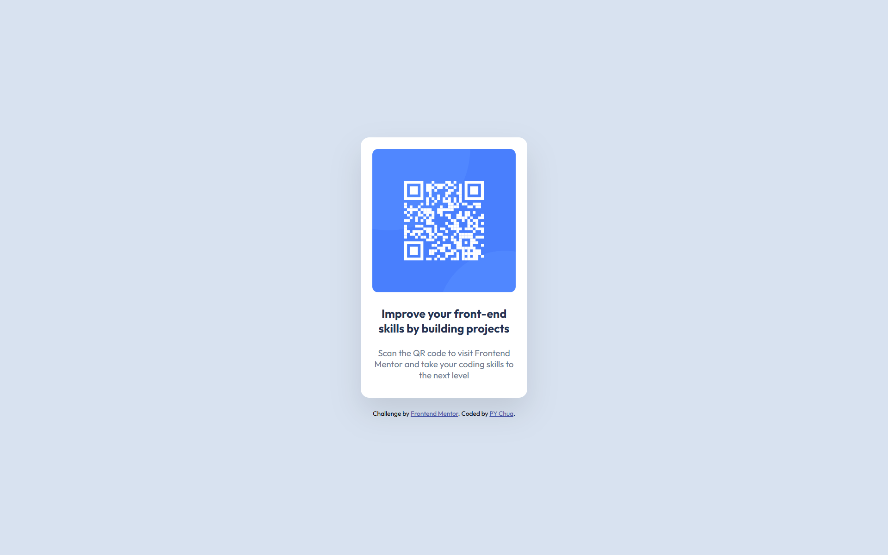

# Frontend Mentor - QR code component solution

This is a solution to the [QR code component challenge on Frontend Mentor](https://www.frontendmentor.io/challenges/qr-code-component-iux_sIO_H). Frontend Mentor challenges help you improve your coding skills by building realistic projects. 

## Table of contents

- [Frontend Mentor - QR code component solution](#frontend-mentor---qr-code-component-solution)
  - [Table of contents](#table-of-contents)
  - [Overview](#overview)
    - [Screenshot](#screenshot)
    - [Links](#links)
  - [My process](#my-process)
    - [Built with](#built-with)
    - [What I learned](#what-i-learned)
  - [Author](#author)

## Overview

### Screenshot



### Links

- [Solution URL](https://www.frontendmentor.io/solutions/mobile-first-qr-code-component-using-css-flexbox-Hyl_eaJb5V)
- [Live Site URL](https://py-chua.github.io/Frontend-mentor-QR-code-component/)

## My process

### Built with

- Semantic HTML5 markup
- CSS custom properties
- Flexbox
- Mobile-first responsive design
- Google Fonts (Outfit)

### What I learned

Through this project, I refined my understanding of mobile-first workflow and responsive design. It was also a great practice in using CSS Flexbox for layout and working with CSS custom properties to streamline color and typography settings.

Here’s a code snippet I’m proud of, which efficiently centers the card component both horizontally and vertically:

```css
body {
  display: flex;
  flex-direction: column;
  justify-content: center;
  align-items: center;
  min-height: 100vh;
}
```

## Author

- Frontend Mentor - [@PY-Chua](https://www.frontendmentor.io/profile/PY-Chua)